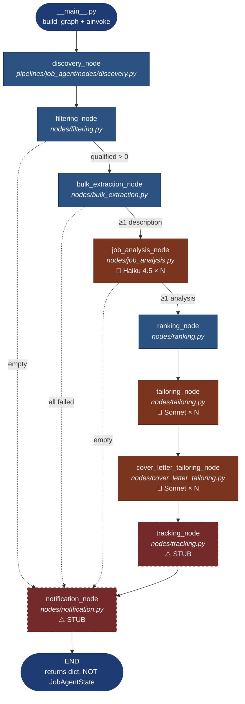
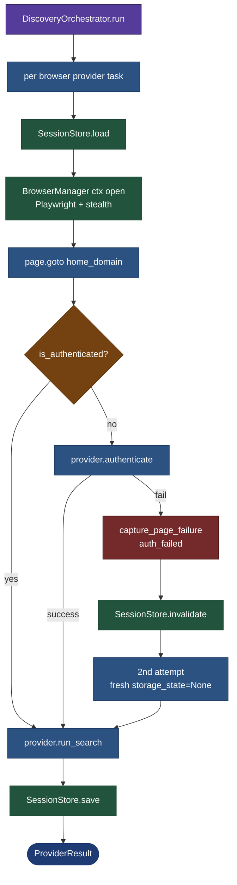

# Kokomoor Platform — Job Agent Pipeline Flow

> Architectural state diagram for the `pipelines.job_agent` LangGraph pipeline,
> showing every node, every conditional edge, every `core/` dependency, every
> LLM touchpoint, and every persistence boundary.
>
> Snapshot taken: **2026-04-10** (post `manual-run` test on
> `variant-modularization-attempt` branch).

---

## 1. High-level pipeline (Mermaid)



---

## 2. Detailed node-by-node breakdown

### Node 0 — `__main__.py` (entrypoint)

| | |
|---|---|
| **Reads** | `core.config.get_settings`, `core.observability.setup_logging` |
| **Writes** | logs only |
| **LLM** | none |
| **DB** | none |
| **Crash site** | line 64 — `final_state.phase.value` (LangGraph returns `dict`, not `JobAgentState`) |

```
┌────────────────────────────────────────────────────────┐
│  setup_logging()                                       │
│  settings = get_settings()                             │
│  criteria = SearchCriteria(keywords/roles/floor/...)   │
│  initial_state = JobAgentState(criteria, run_id)       │
│  graph = build_graph()                                 │
│  final_state = await graph.ainvoke(initial_state)      │
│  ⚠ final_state is a DICT, not JobAgentState           │
└────────────────────────────────────────────────────────┘
```

---

### Node 1 — `discovery_node`

| | |
|---|---|
| **Reads** | `state.search_criteria`, `state.run_id` |
| **Writes** | `state.discovered_listings`, `state.errors`, `state.phase=DISCOVERY` |
| **Core deps** | `core.browser.BrowserManager`, `core.browser.session.SessionStore`, `core.browser.captcha.CaptchaHandler`, `core.browser.human_behavior.HumanBehavior`, `core.browser.debug_capture.FailureCapture` |
| **LLM** | none |
| **DB** | reads `job_listings.dedup_key` (table missing → falls back to file dedup) |

```
discovery_node
  │
  ├─ DiscoveryConfig.from_settings(settings)
  │
  ├─ DiscoveryOrchestrator().run(criteria, config, settings)
  │     │
  │     ├─ HTTP providers (parallel asyncio.gather)
  │     │     ├─ greenhouse  (if config + companies)
  │     │     └─ lever       (if config + companies)
  │     │
  │     └─ Browser providers (under semaphore N=2)
  │           ├─ LinkedInProvider     ── requires session
  │           ├─ IndeedProvider       ── stealth nav
  │           ├─ BuiltInProvider      ── no auth
  │           ├─ WellfoundProvider    ── auth
  │           ├─ WorkdayProvider      ── per-company
  │           └─ DirectSiteProvider   ── YAML configs
  │
  │   ┌──── per browser provider ────┐
  │   │  SessionStore.load(source)   │
  │   │  BrowserManager(storage)     │
  │   │  page.goto(home)             │
  │   │  is_authenticated?           │
  │   │  └─ no → authenticate()      │
  │   │            └─ fail → invalidate + retry once
  │   │  provider.run_search(page)   │
  │   │  SessionStore.save(source)   │
  │   └──────────────────────────────┘
  │
  ├─ deduplicate_refs(refs, in_run_seen, check_db=True)
  │     ├─ Phase 1: in-run set
  │     ├─ Phase 2: SELECT job_listings.dedup_key  ⚠ table missing
  │     └─ Phase 3: FileDedup fallback (data/dedup_seen.json)
  │
  ├─ apply_prefilter(refs, criteria, min_score)
  │
  └─ state.discovered_listings = [ref_to_job_listing(r) for r in passed]
```

---

### Node 2 — `filtering_node`

| | |
|---|---|
| **Reads** | `state.discovered_listings`, `state.search_criteria.salary_floor` |
| **Writes** | `state.qualified_listings`, marks others `FILTERED_OUT` |
| **LLM** | none · **DB** none |

```
for listing in discovered_listings:
    if salary_min ≥ floor OR salary_max ≥ floor: keep
    elif salary_min and salary_max are None:    keep   ← lets unparseable listings through
    else:                                       FILTERED_OUT
```

> ⚠ The "no salary info → keep" rule means LinkedIn cards (which rarely
> expose salary) all bypass the floor and head straight to the expensive
> tailoring step.

**Conditional edge:** `qualified_listings == [] → notification` (skip rest).

---

### Node 3 — `bulk_extraction_node`

| | |
|---|---|
| **Reads** | `state.qualified_listings[*].url` |
| **Writes** | `listing.description`, refines title/company/location/salary |
| **Core deps** | `pipelines.job_agent.extraction.extract_job_data_from_url` → `core.fetch.HttpFetcher` (httpx) |
| **LLM** | none · **DB** none |
| **Concurrency** | sequential, with `asyncio.sleep(1.5–4s)` between each |

```
for listing in qualified_listings:
    if listing.description: skip
    extracted = await extract_job_data_from_url(listing.url)
    listing.description = extracted.cleaned_description
    sleep(1.5–4s)
```

**Conditional edge:** if no listing has a description → notification.

---

### Node 4 — `job_analysis_node`  🤖 (LLM)

| | |
|---|---|
| **Reads** | `state.qualified_listings[*].description` |
| **Writes** | `state.job_analyses[dedup_key] = JobAnalysisResult` |
| **Core deps** | `core.llm.AnthropicClient`, `core.llm.structured.structured_complete`, `core.workflows.StructuredAnalysisEngine` |
| **Model** | `claude-haiku-4-5-20251001` (`KP_JOB_ANALYSIS_MODEL`) |
| **Concurrency** | **SEQUENTIAL** (`for item in items:` in `analysis.py`) |
| **Prompt cache** | **none** |
| **DB** | none |

```
StructuredAnalysisEngine.run(state, llm_client, spec):
  for listing in state.qualified_listings:        ← serial loop
      cache = state.job_analysis_cache.get(key)
      if cache: reuse
      else:
          prompt = tailor_job_analysis.md.format(...)
          result = await structured_complete(
              llm_client,
              model="claude-haiku-4-5-20251001",
              max_tokens=2048,
              response_model=JobAnalysisResult,
          )
          state.job_analyses[dedup_key] = result
```

> 💸 **25 listings × ~$0.005 each = ~$0.13**.
> All sequential. Total wall time during the test: ~3m20s purely waiting on Haiku.

**Conditional edge:** if `job_analyses == {}` → notification.

---

### Node 5 — `ranking_node`

| | |
|---|---|
| **Reads** | `state.qualified_listings`, `KP_TAILORING_MAX_LISTINGS` |
| **Writes** | trims `qualified_listings` to top-N by salary, marks rest `SKIPPED` |
| **LLM** | none · **DB** none |

> ⚠ When salary parsing is broken (LinkedIn) the ranking is meaningless —
> in the test run two listings tied at `salary_max=555_845` (suspicious
> default/parsing artifact).

---

### Node 6 — `tailoring_node`  🤖 (LLM, resume)

| | |
|---|---|
| **Reads** | `qualified_listings`, `state.job_analyses`, master profile YAML |
| **Writes** | `listing.tailored_resume_path`, status → `PENDING_REVIEW` |
| **Core deps** | `core.workflows.TailoringEngine`, `core.llm.AnthropicClient` |
| **Model** | `claude-sonnet-4-20250514` (default `anthropic_model`, **stale**) |
| **Concurrency** | **SEQUENTIAL** |
| **Prompt cache** | **none** |
| **DB** | none |

```
for listing in qualified_listings:
    profile = load_master_profile(yaml)
    inventory_view = format_profile_for_llm(profile, relevant_tags)
    prompt = tailor_resume_plan.md.format(analysis, inventory, rules)
    plan = await structured_complete(model=Sonnet, ResumeTailoringPlan)
    document = apply_tailoring_plan(profile, plan)   # deterministic
    render_resume_docx(document, output_path)
```

> 💸 **2 listings × ~$0.033 each ≈ $0.067**.

---

### Node 7 — `cover_letter_tailoring_node`  🤖 (LLM, cover letter)

| | |
|---|---|
| **Reads** | `qualified_listings`, `state.job_analyses`, profile, style guide |
| **Writes** | `listing.tailored_cover_letter_path` |
| **Model** | `KP_COVER_LETTER_MODEL = claude-sonnet-4-20250514` (**stale**) |
| **Concurrency** | sequential |
| **Prompt cache** | none |

```
for listing in qualified_listings:
    prompt = build_cover_letter_prompt(analysis, profile, style_guide)
    plan = await structured_complete(model=Sonnet, CoverLetterPlan)
    validate_cover_letter_plan(plan, profile)
    doc = apply_cover_letter_plan(plan)
    render_cover_letter_docx(doc)
```

> 💸 **2 listings × ~$0.041 each ≈ $0.083**.

---

### Node 8 — `tracking_node`  ⚠️ STUB

```python
async def tracking_node(state):
    state.phase = PipelinePhase.TRACKING
    logger.info("tracking_update", ...)
    # TODO: Milestone 2 — upsert listings into SQLite via core.database.
    return state
```

> **Nothing is persisted to the database. Ever.** The dedup table the
> discovery node looks for never gets written here either.

---

### Node 9 — `notification_node`  ⚠️ STUB

```python
async def notification_node(state):
    state.phase = PipelinePhase.COMPLETE
    logger.info("pipeline_complete", ...)
    # TODO: Milestone 4 — send email digest via core.notifications.
    return state
```

---

## 3. Core module dependency map

```
pipelines/job_agent/                                core/
├─ nodes/discovery.py        ────► browser/{BrowserManager,session,captcha,
│                                          human_behavior,rate_limiter,
│                                          stealth,debug_capture}
│                            ────► database (read-only dedup query, fails)
│
├─ nodes/bulk_extraction.py  ────► fetch/{HttpFetcher,jsonld,types}
│
├─ nodes/job_analysis.py     ────► workflows/StructuredAnalysisEngine
│                            ────► llm/{AnthropicClient,structured,usage}
│
├─ nodes/tailoring.py        ────► workflows/TailoringEngine
│                            ────► llm/AnthropicClient
│
├─ nodes/cover_letter_       ────► workflows/TailoringEngine
│   tailoring.py             ────► llm/AnthropicClient
│
├─ nodes/tracking.py         ────► (TODO) database
└─ nodes/notification.py     ────► (TODO) notifications/{inbox,heal_auth}

pipelines/scraper/           ────► scraper/{content_store,dedup,fixtures,
                                            http_client,path_safety}
                             ────► browser/*  (heal pipeline)
                             ────► llm/*      (heal pipeline)
```

---

## 4. State lifecycle (data passed between nodes)

```
┌─── JobAgentState (dataclass) ──────────────────────────────┐
│                                                            │
│  search_criteria: SearchCriteria   [INPUT]                 │
│  manual_job_url:  str              [INPUT, manual flow]    │
│  run_id:          str              [INPUT]                 │
│  dry_run:         bool             [INPUT]                 │
│                                                            │
│  phase:                PipelinePhase    set by every node  │
│  discovered_listings:  list[JobListing] discovery →        │
│  qualified_listings:   list[JobListing] filtering+ranking →│
│  job_analyses:         dict[key,JobAnalysisResult]         │
│  job_analysis_cache:   dict[key,JobAnalysisResult]         │
│  tailored_listings:    list[JobListing] tailoring →        │
│  approved_listings:    list[JobListing] (unused)           │
│  applied_listings:     list[JobListing] (unused)           │
│  errors:               list[dict[str,str]]                 │
│                                                            │
└────────────────────────────────────────────────────────────┘

⚠ LangGraph serialises/returns this as a dict — `await graph.ainvoke()`
  yields `dict`, not `JobAgentState`. The cast in __main__ is a lie.
```

---

## 5. Persistence boundary map (current state)

```
┌──────────────────────────────────────────────────────────────┐
│                       PERSISTED                              │
├──────────────────────────────────────────────────────────────┤
│  data/sessions/<source>.json    Playwright storage_state     │
│  data/dedup_seen.json           File-based dedup (fallback)  │
│  data/debug_captures/<run>/     HTML+PNG+metadata on failure │
│  data/tailored_resumes/<run>/   .docx + .md preview          │
│  data/tailored_cover_letters/<run>/  .docx + .md preview     │
├──────────────────────────────────────────────────────────────┤
│                       NOT PERSISTED                          │
├──────────────────────────────────────────────────────────────┤
│  data/platform.db               EXISTS but EMPTY             │
│    └─ job_listings              SCHEMA NEVER CREATED         │
│    └─ pipeline_runs             SCHEMA NEVER CREATED         │
│  alembic/versions/.gitkeep      NO MIGRATIONS WRITTEN        │
│  state.errors                   logged only, never stored    │
│  LLM usage / cost ledger        kept in-memory, dropped at end│
└──────────────────────────────────────────────────────────────┘
```

---

## 6. Discovery sub-graph (where the LinkedIn auth bug lives)



---

## 7. LLM call sites (current pipeline)

| Node | Model | Calls | Cost / call | Run total |
|------|-------|-------|------------:|----------:|
| `job_analysis_node` | claude-haiku-4-5-20251001 | 25 (1 per listing, sequential) | ~$0.005 | **~$0.131** |
| `tailoring_node` (resume plan) | claude-sonnet-4-20250514 ⚠ stale | 2 (after ranking cap) | ~$0.033 | **~$0.067** |
| `cover_letter_tailoring_node` | claude-sonnet-4-20250514 ⚠ stale | 2 | ~$0.041 | **~$0.083** |
| **TOTAL** | | **29** | | **≈ $0.281** |

(*The discrepancy from your noted ~$0.32 is rounding plus a couple of
sub-cent log lines I haven't counted.*)

**Nodes with NO LLM calls:**
`discovery`, `filtering`, `bulk_extraction`, `ranking`, `tracking`,
`notification`, `manual_extraction` (uses heuristic / JSON-LD extractor).

---

## 8. Legend

| Marker | Meaning |
|--------|---------|
| 🤖 | Node makes one or more LLM API calls |
| ⚠️ STUB | Node logs only — no real implementation |
| 💸 | Cost line in the test run |
| Solid arrow | Always-followed graph edge |
| Dashed arrow | Conditional skip-to-end edge |

---

*End of flow diagram. This file is suitable for piping into a diagram-generator
LLM (e.g. "render this Mermaid as an SVG poster").*
